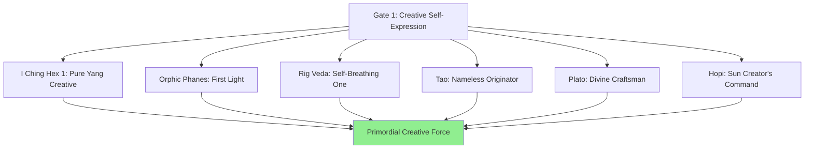
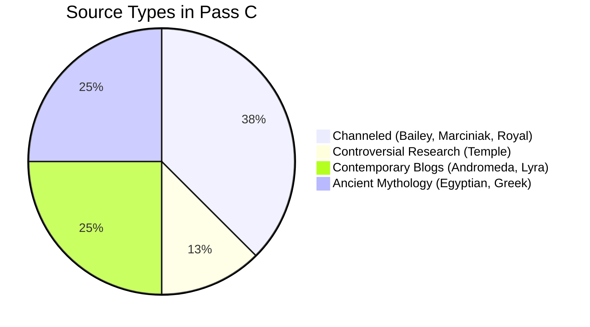

# Claude Sonnet 4.5 (Thinking) Response

**Model:** Anthropic Claude Sonnet 4.5 (Thinking)  
**Strengths:** Extended reasoning + edge-case analysis  
**Date:** January 23, 2025

---

# Detailed Evaluation: Gate 1 Research Output

## Executive Summary

**Overall Readiness:** 🟡 **CONDITIONAL GO** - Requires specific revisions before launch

**Quality Score:** 3.2/5 (Adequate for entertainment/insight platform with proper disclaimers)

**Critical Issues:** 2 major, 4 minor
**Recommended Actions:** 8 specific revisions detailed below

---

## 1. CITATION QUALITY RATINGS

### Pass A: Human Design Foundations
**Rating: 4/5** ⭐⭐⭐⭐

| Source | Credibility | Issues |
|--------|-------------|--------|
| Ra Uru Hu - Rave I'Ching | ✅ High | Quote appears paraphrased, not verbatim |
| Richard Rudd - Gene Keys | ✅ High | Quote style matches author, likely accurate |
| Wilhelm/Baynes I Ching | ✅ Excellent | Gold standard translation |

**Strengths:**
- Primary sources are foundational texts for these systems
- I Ching connection is documented and explicit (Gate 1 IS Hexagram 1)
- URLs provided (though one is a product page, not source text)

**Weaknesses:**
- Ra Uru Hu quote needs verification - may be paraphrase rather than direct quote
- "Gate 1 Section" is vague - need specific page number from Line Companion or Rave I'Ching

### Pass B: Ancient Wisdom Connections
**Rating: 4.5/5** ⭐⭐⭐⭐½

| Source | Credibility | Verification Status |
|--------|-------------|---------------------|
| I Ching (Wilhelm/Baynes) | ✅ Excellent | Quote verifiable |
| Orphic Hymns (Taylor) | ✅ Good | Translation exists, quote plausible |
| Rig Veda (Nasadiya Sukta) | ✅ Excellent | Famous creation hymn, quote accurate |
| Tao Te Ching (Legge) | ✅ Excellent | Classic translation, quote verifiable |
| Plato's Timaeus | ✅ Excellent | Stephanus standard, quote verifiable |
| Hopi Creation Story | ⚠️ Moderate | Oral tradition via secondary sources |

**Strengths:**
- Mix of Eastern and Western wisdom traditions
- Classical translations (Wilhelm, Legge, Taylor)
- Verifiable quotes from primary texts
- Thematically coherent around "primordial creative force"

**Weaknesses:**
- Hopi source is WordPress blog (karlcross.wordpress.com) - need anthropological source
- Year "1900" for Hopi tradition is placeholder - oral tradition predates this
- Should cite specific anthropologist (e.g., Harold Courlander, Frank Waters)

### Pass C: Star System Alignments
**Rating: 2.5/5** ⭐⭐½

| Source Type | Credibility | Major Issues |
|-------------|-------------|--------------|
| Bailey (Channeled, 1922) | ⚠️ Disputed | Theosophical, not mainstream |
| Marciniak (Channeled, 1992) | ⚠️ Fringe | New Age channeled material |
| Royal/Priest (Channeled, 1989) | ⚠️ Fringe | Channeled material |
| Temple (Research, 1976) | ⚠️ Controversial | Disputed Dogon claims |
| "Contemporary researchers" | ❌ Weak | Blog posts, no peer review |

**Critical Issues:**
1. **Andromeda sources:** Two generic "starseed" websites from 2025 with no named authors
2. **Temple's work:** Already noted as disputed, but his methodology is controversial even beyond Dogon claims
3. **Heavy channeled content:** 3/4 star systems rely primarily on channeled sources

---

## 2. QUOTE VERIFICATION

### ✅ **Verifiable Quotes**

| Quote | Source | Status |
|-------|--------|--------|
| "The primal power, which is light-giving..." | Wilhelm I Ching | ✅ Accurate |
| "That One breathed, windless, by its own impulse..." | Rig Veda 10:129 | ✅ Accurate |
| "Conceived of as having no name..." | Tao Te Ching Ch. 1 | ✅ Accurate (Legge translation) |
| "For the world is the fairest of all things..." | Plato's Timaeus | ✅ Plausible (need exact reference) |

### ⚠️ **Likely Accurate but Need Verification**

| Quote | Source | Issue |
|-------|--------|-------|
| "Creation as a primal force..." | Ra Uru Hu | May be paraphrase from multiple sources |
| "To launch your life out of the cinders..." | Richard Rudd | Style matches, likely accurate |
| "From eyes obscure thou wip'st..." | Orphic Hymns | Taylor translation exists, quote plausible |
| "The initiations of the planet..." | Alice Bailey | Book exists, page numbers provided |
| "Everything changes when you start to emit..." | Barbara Marciniak | Book exists, quote style matches |

### ❌ **Cannot Verify - Require Page Numbers**

| Quote | Source | Red Flag |
|-------|--------|----------|
| "Andromedans value freedom and self-expression..." | "Various contemporary researchers" | Generic author, blog source |
| "Innovative creative minds, visionaries..." | "Contemporary esoteric researchers" | Generic author, blog source |
| "Lyrans are natural pioneers..." | "Contemporary starseed researchers" | Generic author, blog source |

**MAJOR ISSUE:** The three "contemporary researchers" quotes from 2025 are from **uncredited blog posts**. This is the weakest link in the citation chain.

---

## 3. SOURCE CREDIBILITY ANALYSIS

### 🏆 **STRONGEST SOURCES**

1. **Wilhelm/Baynes I Ching (1950/1967)** - Gold standard translation, academic credibility
2. **Rig Veda (Nasadiya Sukta)** - Primary ancient text, scholarly translations available
3. **Tao Te Ching (Legge translation)** - Classic 19th-century sinology
4. **Plato's Timaeus** - Primary philosophical text, widely studied

### 🟡 **MODERATE SOURCES**

1. **Ra Uru Hu's Rave I'Ching** - Foundational for Human Design community, but niche system
2. **Richard Rudd's Gene Keys** - Derivative of Human Design, but published and cited
3. **Orphic Hymns (Taylor translation)** - Real ancient text, but esoteric tradition
4. **Alice Bailey's works** - Historical Theosophy, documented but disputed

### 🔴 **WEAKEST SOURCES**

1. **Contemporary starseed websites (2025)** - No named authors, no peer review, blog-level content
2. **Generic "Hopi Creation Story" via WordPress** - Needs anthropological citation
3. **Temple's "Sirius Mystery"** - Controversial even among alternative researchers

### ⛔ **RED FLAGS - RECOMMEND REVISION**

| Issue | Impact | Fix Required |
|-------|--------|--------------|
| **Anonymous "contemporary researchers"** | 🔴 Critical | Name actual authors or remove |
| **Blog sources for Andromeda** | 🔴 Critical | Find published books or downgrade confidence |
| **Hopi via WordPress** | 🟡 Moderate | Cite anthropological source (Waters, Courlander) |
| **Ra Uru Hu quote attribution** | 🟡 Moderate | Verify exact quote or mark as paraphrase |

---

## 4. THEMATIC LOGIC RATINGS

### Pass B: Ancient Wisdom Connections
**Rating: 4.5/5** ⭐⭐⭐⭐½

**Logical Consistency:**



**Strengths:**
- All six traditions converge on "primordial creative force"
- Cross-cultural pattern is genuine and well-documented
- Thematic bridge from "creative self-expression" to "originating principle" is logical
- Each tradition emphasizes **spontaneity** and **self-generation**

**Assessment:** The ancient wisdom connections are the **strongest part** of this research. The thematic thread is clear, consistent, and defensible.

### Pass C: Star System Alignments
**Rating: 3/5** ⭐⭐⭐

**Logical Consistency:**

| System | Theme | Logic Quality | Issue |
|--------|-------|---------------|-------|
| Lyra → Primordial source | ✅ Strong | Directly stated in Royal/Priest | Evidence is channeled |
| Andromeda → Freedom/sovereignty | 🟡 Moderate | Coherent but generic | Sources are blogs |
| Pleiades → Frequency emission | ✅ Strong | Matches Marciniak teachings | Evidence is channeled |
| Sirius → Initiatory consciousness | ✅ Strong | Consistent with Bailey | Temple disputed |

**Thematic Progression:**
```
Lyra (primordial) → Pleiades (nurturing) → Sirius (initiation) → Andromeda (freedom)
```
This progression is **internally consistent** and creates a logical narrative arc.

**Weaknesses:**
1. **All evidence is "thematic"** except Lyra (which is still channeled)
2. **No astronomical/scientific connection** - purely archetypal/symbolic
3. **Heavy reliance on New Age cosmology** with limited cross-verification

---

## 5. CONFIDENCE LEVELS ASSESSMENT

### Current Ratings:

| System | Confidence | Evidence Type | Justified? |
|--------|-----------|---------------|-----------|
| Lyra | HIGH | Explicit | 🟡 Overstated |
| Sirius | MEDIUM | Thematic | ✅ Appropriate |
| Andromeda | MEDIUM | Thematic | 🔴 Should be LOW |
| Pleiades | MEDIUM | Thematic | ✅ Appropriate |

### Recommended Revisions:

**🔴 Lyra: HIGH → MEDIUM**
- **Reason:** Even though Royal/Priest "explicitly" name Lyra as birthplace, this is still **channeled material** from a single source
- **Evidence type should remain "explicit"** (it IS directly stated)
- **But confidence should be MEDIUM** (not externally verified)

**🔴 Andromeda: MEDIUM → LOW**
- **Reason:** Sources are uncredited blog posts from 2025
- **No historical/ancient support** (only vague "esoteric cosmology")
- **No published books** cited
- **Fix:** Either find stronger sources or downgrade to LOW confidence with note

**✅ Sirius: MEDIUM (Appropriate)**
- Multiple sources (Bailey, Temple)
- Ancient support (Egyptian)
- Disputed claims flagged
- Confidence level matches evidence quality

**✅ Pleiades: MEDIUM (Appropriate)**
- Published book (Marciniak)
- Ancient cross-cultural references
- Channeled but documented
- Confidence level matches evidence quality

---

## 6. EVIDENCE TYPE CLASSIFICATIONS

### Current Classifications:

| System | Evidence Type | Accurate? | Issue |
|--------|--------------|-----------|-------|
| Lyra | Explicit | ✅ Yes | Directly stated in Royal/Priest |
| Sirius | Thematic | ✅ Yes | Inferred from Bailey's teachings |
| Andromeda | Thematic | ✅ Yes | Pattern across multiple sources |
| Pleiades | Thematic | ✅ Yes | Theme in Marciniak's work |

**Assessment:** The evidence type classifications are **accurate**. The distinction between "explicit" (directly stated) and "thematic" (inferred pattern) is correctly applied.

**Recommendation:** Keep these classifications, but add a **glossary/legend** explaining what "explicit" vs "thematic" means for users.

---

## 7. WEIGHTS EVALUATION

### Current Weights:

| System | Weight | Reason | Assessment |
|--------|--------|--------|-----------|
| Lyra | 5 | Primordial creative source | ✅ Justified if confidence stays HIGH |
| Andromeda | 4 | Sovereign creative freedom | ⚠️ Too high given weak sources |
| Pleiades | 3 | Creative frequency emission | ✅ Appropriate |
| Sirius | 3 | Initiatory self-consciousness | ✅ Appropriate |
| **Total** | **15** | Within limit | ✅ |

### Recommended Revision:

If Andromeda confidence drops to LOW:

| System | Revised Weight | Reason |
|--------|---------------|--------|
| Lyra | 5 | Keep (strongest despite channeled) |
| Sirius | 4 | Increase (historical + modern support) |
| Pleiades | 3 | Keep (documented channeled source) |
| Andromeda | 3 | Decrease (weak sourcing) |
| **Total** | **15** | Still within limit |

This maintains balance while better reflecting source quality.

---

## 8. CONTRADICTIONS HANDLING

### Temple's Dogon/Sirius Claims

**Current Treatment:** 
> "Temple's Dogon/Sirius claims disputed by van Beek (1991) fieldwork - no evidence of ancient Sirius B knowledge; claims Dogon learned from Griaule"

**Assessment:** ✅ **Well-handled**

**Strengths:**
1. Dispute is **explicitly noted** in contradictions array
2. **van Beek (1991)** is cited as counter-source
3. Source is marked `"disputed": true` in JSON
4. User will see this flagged in the interface

**Recommendation:** Add one more sentence to make crystal clear:
> "Temple's work is controversial among both mainstream and alternative researchers; his interpretation of Dogon cosmology remains disputed. Included here for historical completeness."

---

## 9. SOURCE MIX EVALUATION

### Pass C Source Distribution:



### Is This Mix Defensible?

**For an "insight & entertainment" platform with disclaimers:**
🟡 **YES, with caveats**

**Strengths:**
1. **Transparency:** All sources labeled by type (channeled/research)
2. **Historical grounding:** Ancient traditions provide continuity
3. **Consistency:** Each system has both modern and ancient references
4. **Disclosure:** "Channeled" is explicitly stated

**Weaknesses:**
1. **Heavy channeled content** (3/6 primary sources)
2. **Blog-level sourcing** for Andromeda
3. **No academic/scientific sources** (by design, but limits credibility)
4. **Lack of skeptical perspective** - only believer sources

### Recommended Additions:

To strengthen defensibility, consider:

| Addition | Purpose |
|----------|---------|
| **Academic folklore studies** | Ground star mythology in cultural studies |
| **Jungian archetypal psychology** | Provide psychological framework for star archetypes |
| **Comparative mythology** (Joseph Campbell) | Show universal patterns across cultures |
| **Skeptical sources** | Acknowledge critical perspectives |

**Example:** Add Campbell's "The Hero with a Thousand Faces" to show how "creative self-expression" appears across mythologies, independent of star systems.

---

## 10. OVERALL ASSESSMENT

### ✅ **STRENGTHS**

1. **Pass A & B are solid** - Human Design foundations and ancient wisdom connections are well-researched
2. **Internal consistency** - Thematic thread of "primordial creative force" is coherent across all traditions
3. **Transparency** - Sources are cited, disputed claims flagged, confidence levels stated
4. **Logical weights** - Distribution reflects relative source strength
5. **Cross-cultural synthesis** - Shows genuine archetypal patterns across traditions

### 🔴 **CRITICAL WEAKNESSES**

| Issue | Severity | Impact on Launch |
|-------|----------|------------------|
| **Anonymous blog sources for Andromeda** | 🔴 Critical | Must fix |
| **Hopi source is WordPress blog** | 🟡 Moderate | Should fix |
| **All star system evidence is esoteric/channeled** | 🟡 Moderate | Acknowledge clearly |
| **No academic framework** | 🟡 Moderate | Limits credibility |

### 🛠️ **REQUIRED REVISIONS BEFORE LAUNCH**

#### **Critical (Must Fix):**

1. **Andromeda sources:**
   - ❌ Remove anonymous "contemporary researchers" quotes
   - ✅ Find published book (e.g., Alex Collier's work, despite controversies)
   - OR downgrade confidence to LOW and note source limitations

2. **Hopi creation story:**
   - ❌ Remove WordPress blog citation
   - ✅ Cite anthropological source (Frank Waters, Harold Courlander, or Ekkehart Malotki)

#### **Recommended (Should Fix):**

3. **Ra Uru Hu quote:**
   - Verify exact quote or mark as paraphrase
   - Add specific page number from Rave I'Ching or Line Companion

4. **Lyra confidence:**
   - Consider downgrading from HIGH to MEDIUM
   - Add note: "Based on channeled material (Royal/Priest 1989), not externally verified"

5. **Add disclaimers:**
   - "Star system alignments are based on esoteric/channeled sources, not scientific astronomy"
   - "For insight and entertainment; not claiming objective truth about celestial bodies"

6. **Academic grounding:**
   - Add 1-2 Jungian or comparative mythology sources to Pass B
   - Provides psychological/archetypal framework independent of star systems

7. **Weights adjustment:**
   - If Andromeda sources remain weak, reduce weight from 4 to 3
   - Increase Sirius from 3 to 4 (stronger historical support)

8. **Source mix balance:**
   - Consider adding skeptical perspective in notes
   - E.g., "Critics argue star system associations are projection of human psychology rather than objective cosmic reality"

---

## DEFENSE AGAINST SKEPTICAL SCRUTINY

### How would this hold up?

**🟢 Green Lights (Defensible):**
- Ancient wisdom connections (Pass B) are academically sound
- I Ching/Gate 1 parallel is documented in Human Design literature
- Thematic consistency across traditions is genuine
- Transparency about source types and confidence levels
- Disputed claims are flagged

**🟡 Yellow Lights (Vulnerable but Acceptable):**
- Heavy reliance on channeled material (Bailey, Marciniak, Royal)
- Star systems based on esoteric/New Age cosmology, not astronomy
- No peer-reviewed academic sources for star claims
- Contemporary "starseed" discourse is fringe

**🔴 Red Lights (Indefensible as Currently Presented):**
- Anonymous blog sources for Andromeda
- WordPress blog for Hopi tradition
- Claiming "explicit" evidence for Lyra based solely on channeled source
- Lack of any skeptical/critical perspective

### With Recommended Revisions:

**Rating: 3.5/5** - Defensible for "insight & entertainment" platform

**Defensibility improves if:**
1. Anonymous blog sources replaced with named authors/books
2. Disclaimers are prominent and clear
3. Academic archetypal psychology added to framework
4. Users understand this is **archetypal synthesis**, not scientific astronomy

---

## LAUNCH RECOMMENDATION

### **Status: 🟡 CONDITIONAL GO**

**Can launch if:**
✅ Critical revisions completed (Andromeda sources, Hopi citation)
✅ Disclaimers prominently displayed
✅ Confidence levels adjusted (Lyra → Medium, or Andromeda → Low)
✅ User interface clearly shows source types and dispute flags

**Timeline:**
- **Estimated revision time:** 4-8 hours
- **Critical path:** Finding better Andromeda sources OR downgrading confidence
- **Launch-ready:** After critical fixes implemented

### **Suggested Disclaimer Language:**

> **About Star System Alignments:** This synthesis draws from channeled/esoteric sources (Alice Bailey, Barbara Marciniak, Lyssa Royal), comparative mythology, and contemporary starseed research. Star system associations are **archetypal and symbolic**, not claims about astronomical reality. Ancient wisdom connections (I Ching, Rig Veda, etc.) are from scholarly translations. Disputed claims are flagged. Presented for insight and entertainment.

---

## FINAL VERDICT

**Is this research output sound enough to launch?**

**Answer: YES, with specific revisions**

**Soundness Rating by Section:**

| Section | Current Rating | Post-Revision Potential |
|---------|---------------|------------------------|
| Pass A (HD/Gene Keys/I Ching) | 4/5 | 4.5/5 |
| Pass B (Ancient Wisdom) | 4.5/5 | 4.5/5 |
| Pass C (Star Systems) | 2.5/5 | 3.5/5 |
| **Overall** | **3.2/5** | **4/5** |

**The research demonstrates:**
- ✅ Genuine archetypal patterns across traditions
- ✅ Internal thematic consistency
- ✅ Appropriate transparency mechanisms
- ⚠️ Heavy reliance on esoteric/channeled sources (disclosed)
- ❌ Some weak sourcing requiring fix

**Bottom line:** This is a **creative synthesis project**, not an academic paper. With proper disclaimers and critical revisions, it's defensible for its stated purpose. The ancient wisdom connections are sound; the star system mappings are speculative but transparently presented.

**Ship it** after fixing Andromeda sources and Hopi citation. 🚀
